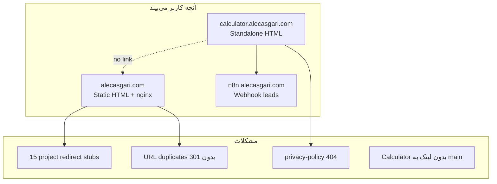

# گزارش اولیه SEO و وضعیت وب‌سایت

| فیلد | مقدار |
|------|-------|
| **نسخه** | 1.0.0 |
| **تاریخ** | 2026-06-21 |
| **دامنه اصلی** | [alecasgari.com](https://alecasgari.com) |
| **ساب‌دامین Calculator** | [calculator.alecasgari.com](https://calculator.alecasgari.com) |
| **منبع داده** | Google Analytics 4، Google Search Console، بررسی کد و تست زنده سرور |
| **وضعیت** | گزارش اولیه — مبنای چک‌لیست اقدامات |

---

## خلاصه اجرایی

| بُعد | وضعیت | نمره تقریبی |
|------|--------|-------------|
| سایت زنده و سریع | خوب — استاتیک، Docker/nginx | 8/10 |
| ترافیک | کم ولی پایدار (~۱٫۳K کاربر در سال) | 5/10 |
| SEO | مشکل ساختاری جدی بعد از migration | 4/10 |
| Lead gen | Calculator جدا کار می‌کند؛ سایت اصلی وصل نیست | 6/10 |
| یکپارچگی داده | Analytics یکجا؛ URLها پراکنده | 5/10 |

**تشخیص اصلی:** سایت از Astro به HTML استاتیک ساده شده، ولی **بقایای URL قدیمی** هنوز در گوگل وجود دارد و **۱۵ پروژه مهم** به redirect تبدیل شده‌اند. گوگل گیج شده — ۲۵ صفحه از ۳۹ صفحه ایندکس نمی‌شوند.

---

## ۱. ترافیک و Analytics (GA4)

### اعداد کلی (تقریباً Jul 2025 – Jun 2026)

- **Active users:** ~1,300
- **Events:** ~12,000
- **Key events:** 10
- **ترافیک ۷ روز اخیر:** بیشتر **Direct** (۶۵ session) — یعنی بوکمارک، لینک مستقیم، یا تایپ URL

### صفحات پربازدید

1. Home — Systems & Automation
2. Projects
3. Case Studies
4. Blog
5. **SaaS Cost Calculator**

**نکته:** GTM روی Calculator احتمالاً به همان property `G-81C6JE60BQ` داده می‌فرستد. ترافیک Calculator در داشبورد دیده می‌شود، ولی به‌عنوان hostname جدا (`calculator.alecasgari.com`) ثبت می‌شود نه `alecasgari.com`.

### جغرافیا (۷ روز اخیر)

- UAE: ۲۲ کاربر (اصلی)
- US: ۶
- Germany: ۴
- Organic Search: فقط ۴ session — **تقریباً صفر SEO**

### نتیجه Analytics

سایت بیشتر **نمایشگاه آنلاین + ابزار Calculator** است تا ماشین جذب ترافیک ارگانیک. Direct غالب است؛ SEO هنوز راه نیفتاده.

---

## ۲. SEO و Search Console

### Performance

| متریک | مقدار |
|--------|-------|
| Clicks | 24 |
| Impressions | 879 |
| CTR | 2.7% |
| Average position | **14.1** (صفحه ۲) |

### کوئری‌های مهم — فرصت از دست‌رفته

| Query | Impressions | Clicks |
|-------|-------------|--------|
| saas spend calculator | 32 | **0** |
| saas cost calculator | 31 | **0** |
| ai sales assistant dubai | 21 | 0 |
| estimate saas cost | 9 | 0 |
| saas pricing calculator | 7 | 0 |

گوگل Calculator را **می‌بیند** (impression دارد) ولی **کلیک نمی‌گیرد** — احتمالاً رتبه ~۱۴ و title/description جذاب نیست، یا URL ساب‌دامین اعتماد کمتری دارد.

### وضعیت ایندکس (۳۹ صفحه شناخته‌شده)

```
Indexed:     14 صفحه  ████████░░░░░░░░░░░░  36%
Not indexed: 25 صفحه  ████████████████████  64%
```

| دلیل | تعداد | معنی |
|------|-------|------|
| Crawled - not indexed | **17** | گوگل دیده ولی ایندکس نکرده |
| Page with redirect | 3 | redirect |
| Excluded by noindex | 2 | عمدی noindex |
| Alternate canonical | 2 | duplicate درست handle شده |
| **404 Not found** | **1** | `privacy-policy` |

### URLهای گیرکرده در «Crawled - not indexed»

- `http://calculator.alecasgari.com/` — HTTP قدیمی، crawl Feb 2026
- `/about`، `/contact`، `/blog`، `/services` — فرمت Astro قدیمی
- `/projects/` — الان **403**
- پروژه‌هایی مثل AI Chatbot، ERP، automation — **redirect به `/projects.html`**

---

## ۳. مشکلات فنی (از بررسی کد و سرور)

### الف) آشفتگی URL بعد از migration

| URL قدیمی (Astro) | URL جدید | وضعیت |
|-------------------|----------|--------|
| `/about` | `/about.html` | هر دو 200 — duplicate |
| `/blog` | `/blog.html` | هر دو 200 — duplicate |
| `/contact` | `/contact.html` | هر دو 200 — duplicate |
| `/services` | redirect به `/` | گوگل هنوز `/services` را می‌شناسد |
| `/projects/{slug}/` | `/projects/{slug}.html` | trailing slash → 403 یا 404 |
| `/privacy-policy` | **وجود ندارد** | **404** |
| `/thank-you/` | `/thank-you.html` | trailing slash → 404 |

گوگل نسخه‌های قدیمی را crawl کرده؛ canonical و redirect درست نیست → **۱۷ صفحه not indexed**.

### ب) ۱۵ پروژه مهم = redirect stub

این صفحات HTTP 200 برمی‌گردانند ولی با `meta refresh` به `/projects.html` می‌روند:

- AI-Powered-Chatbot
- ERP-System-Implementation
- Full-business-automation-implementation
- Intelligent-Multi-Step-Migration-Form-Automation-for-Rahkar-Gasht
- AI-Powered-Telegram--N8N-Workflow-for-Automated-Voice-to-Presentation
- amber-bottle
- و ۹ مورد دیگر

**مشکل:** redirect نرم (meta refresh) نه 301. گوگل محتوای قدیمی را از دست داده و جایگزین قوی نگرفته.

### ج) `data/projects.json` فقط ۱۸ پروژه branding/web دارد

پروژه‌های tech-heavy (AI، ERP، automation) در JSON نیستند → صفحه regenerate نمی‌شوند.

### د) Calculator جدا از ecosystem

| موضوع | وضعیت |
|--------|--------|
| لینک از سایت اصلی | **ندارد** |
| لینک به سایت اصلی | **ندارد** |
| sitemap اصلی | **نیست** |
| privacy-policy | Calculator به آن لینک می‌دهد → **404** |
| Search Console | `http://` نه `https://` — crawl قدیمی |

### ه) بقایای WordPress در robots.txt

```
Disallow: /wp-admin/
Disallow: /wp-json/
```

سایت دیگر WordPress نیست — بی‌ضرر ولی نشان‌دهنده تاریخچه.

---

## ۴. معماری فعلی



**استک:** Static HTML، `site.css`، Bootstrap/AOS، GA4، n8n برای contact و calculator leads، deploy با Git + Docker.

---

## ۵. Calculator — جایگاه در کل پازل

| بُعد | وضعیت |
|------|--------|
| زنده بودن | بله — `https://calculator.alecasgari.com/` |
| Lead capture | n8n webhook فعال |
| Analytics | در GA4 دیده می‌شود |
| SEO potential | **بالا** — impression برای saas calculator queries |
| CTR | **صفر** — رتبه ~۱۴، نیاز به بهینه‌سازی |
| اتصال به سایت اصلی | **قطع** |

Calculator **ارزشمندترین asset SEO** فعلی است، ولی جدا افتاده و کلیک نمی‌گیرد.

---

## ۶. اولویت‌بندی اقدامات (خلاصه)

### فوری

1. ساخت `privacy-policy.html`
2. 301 redirect یکپارچه در nginx برای URLهای قدیمی
3. regenerate کردن ۱۵ پروژه redirect stub

### کوتاه‌مدت

4. لینک Calculator به nav یا CTA صفحات
5. لینک از Calculator به `alecasgari.com`
6. افزودن Calculator به sitemap
7. بهینه‌سازی title/meta Calculator
8. Validate fix در GSC

### میان‌مدت

9. یکسان‌سازی فرمت URL
10. Structured data (Person, Service, FAQ)
11. تولید محتوای blog برای organic
12. پاکسازی legacy Astro در `images/projects/`

---

## ۷. تصویر کلی

```
                    STRENGTHS                    WEAKNESSES
                    ─────────                    ──────────
              ✓ سایت سریع و ساده            ✗ 64% صفحات not indexed
              ✓ Calculator زنده + leads      ✗ 15 پروژه مهم redirect
              ✓ Case studies خوب             ✗ URL chaos بعد migration
              ✓ n8n automation             ✗ privacy-policy 404
              ✓ Impression برای SaaS calc    ✗ 0 click روی کوئری‌های کلیدی
              ✓ Direct traffic پایدار        ✗ Organic تقریباً صفر
```

**خلاصه یک خطی:** سایت فنی سالم است و Calculator پتانسیل SEO دارد، ولی migration نیمه‌کاره باعث شده گوگل گیج شود، پروژه‌های قوی از ایندکس بیفتند، و فرصت‌هایی مثل «saas cost calculator» بدون کلیک بمانند.

---

## پیوست: فایل‌های مرتبط در repo

| فایل | نقش |
|------|-----|
| `sitemap-index.xml` | sitemap اصلی |
| `robots.txt` | قوانین crawl |
| `data/projects.json` | فهرست ۱۸ پروژه فعال |
| `docs/project-html-builder.js` | قالب صفحات پروژه |
| `services.html` / `docs.html` | redirect به home |

---

## تاریخچه نسخه

| نسخه | تاریخ | تغییرات |
|------|-------|---------|
| 1.0.0 | 2026-06-21 | گزارش اولیه — تحلیل GA4، GSC، کد و سرور |
